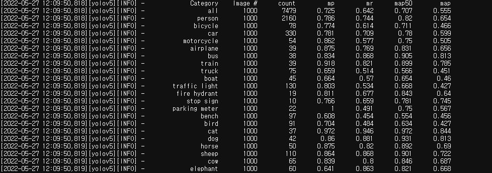

# Object_Detection
객체 검출 모듈 연구

많은 소타모델이 있지만, 현실적으로 관리되지 않는 디텍션 모듈(안정되지 않은)을 운영단계에서 도입할수 없음. 오픈소스로 잘 관리되고 있는 yolov5를 채택하는것이 맞을것으로 보임.

|모델명                                                  |데이터셋|성능|eval 결과 (mAP)|비고|
|---                                                    |---|---|---|---|
|[DAB-DETR](https://github.com/IDEA-opensource/DAB-DETR)|[coco test-dev](https://paperswithcode.com/sota/object-detection-on-coco)|box AP 63.3|mAP50 61.6 </br> mAP 44.8|전체 코드 없음|
|[SwinV2+HTC](https://github.com/microsoft/Swin-Transformer)|[coco test-dev](https://paperswithcode.com/sota/object-detection-on-coco)|box AP 63.1||swinv2 아직 mmdetection 지원 x|
|[YOLOv5x6 + TTA]([https://github.com/ultralytics/yolov5])|[coco eval](https://github.com/ultralytics/yolov5)|mAP 55.8|mAP50 70.8 </br> mAP 55.5|무|
|[YOLOR-D6](https://github.com/WongKinYiu/yolor)|coco dataset|mAP 	57.3|mAP50 68.5 </br> mAP 52.6|무|
|[YOLOX-s](https://github.com/Megvii-BaseDetection/YOLOX)|[Argoverse-HD dataset](https://paperswithcode.com/dataset/argoverse)|AP 40.5|mAP50 61.5 </br> mAP 45.3|무|
|[YOLOX-x](https://github.com/Megvii-BaseDetection/YOLOX)|[Argoverse-HD dataset](https://paperswithcode.com/dataset/argoverse)|AP 51.1|mAP50 70.7 </br> mAP 55.5|무|
|[DynamicHead](https://github.com/microsoft/DynamicHead)|coco dataset|COCO mAP 49.8|mAP50 68.4998 </br> mAP 49.6351|무|
|[GLIP-L](https://github.com/microsoft/GLIP)|FourODs,GoldG,CC3M+12M,SBU|COCO mAP 51.4||inference 속도가 약 0.25s 이기에 매우 느림. real time으로 활용하기에는 부적합|
|[YOLOv7](https://github.com/WongKinYiu/yolov7)|coco dataset|AP 51.4|mAP50 70.7 </br> mAP 55.1|무|
|[YOLOv7-e6e](https://github.com/WongKinYiu/yolov7)|coco dataset|AP 56.8|mAP50 72.1 </br> mAP 57.1|무|


위의 모델들에 대해 테스트하는 데이터셋은
http://49.50.163.17:8888/lab 의 /home/ubuntu/workspace/dataset/eval 폴더에서 찾아보실 수 있습니다.

* 입력된 커맨드 정보: command list.ipynb
* 선택된 이미지들 위치: images/
* 해당 이미지들에 대한 coco 정보: selected_instances_val2017.json
* yolor_p6 결과: yolor_p6_result/
* yolox_s 결과: yolox_s_result/
* yolox_x 결과: yolox_x_result/


# Ongoing

## yolov5

Objects365.yaml 학습 진행 중.
```bash
python -m torch.distributed.run --nproc_per_node 3 train.py --batch 66 --data coco.yaml --weights yolov5s.pt --device 0,1,2 --data Objects365.yaml
```

## DAB-DETR
코드에서 바로 Swin backbone을 적용하여 실행하면 실행이 안됨, 코드 일부 수정 필요, 현재 수정중

### Todo
1. Swin backbone 적용하여 성능평가
2. multiscale model인 DAB-Deformable-DETR모델에 Swin backbone 적용하여 성능평가
3. SOTA인 DINO 구현하기

## SwinV2+HTC
SwinV2가 mmdetection에 올라가있지 않음, 적용시키려면 Swin 모듈을 따로 import 해서 사용해야 할 듯함
SwinV2-large config 찾기 어려움

### Todo
1. SwinV2 + HTC 구현

## DynamicHead
1. install 해야 함
2. dependent 패키지 확인해야함
3. detection 결과를 성능평가 툴에 맞추어 출력해야함

### Todo
1. detection 코드 수정

### 테스트 결과
1. 자체적 mAP, mAP50, mAP75 결과 및항목별 AP 제공.
2. 사용 방법은 config 파일의 DATASET.TEST 의 리스트에 customized 된 데이터셋 이름을 추가하면 됨.
3. customized 된 데이터셋을 추가하는 방법은 train_net.py 상단에 아래와 같은 코드를 추가:
```bash
from detectron2.data.datasets import register_coco_instances
register_coco_instances("map_eval_testset", {}, "/home/ubuntu/workspace/dataset/eval/selected_instances_val2017.json", "/home/ubuntu/workspace/data/eval/images")
# 괄호 안 parameter는 각각 순서대로 정의된 데이터셋 이름, 추가 데이터정보, annotation (coco형식) 위치, 이미지 디렉토리 절대경로 이다
```

## GLIP
1. install 해야 함
2. 구조 이해 및 성능 평가 진행

# 성능 평가

## 평가 정보
- mp: mean precision
- mr: mean recall
- map50: mean average precision (IOU Threshold = 0.5)
- map:  mean average precision (0.05의 단계 크기로 0.5부터 0.95까지의 IoU에 대한 평균 AP)

## 실행 방법
```bash
python calc_map.py target_path=디텍션 결과가 저장된 json 파일 위치
```

## 입력 데이터


해당 코드는 아래 dictionary 형태로 detection 툴의 출력을 넘겨받아 작업합니다.

```python
# x1, y1: left top (float)
# x2, y2: right bottom (float)
# conf: 예측 confidence (float)
# cls: class index (float)
detection 결과 리스트 = [[x1, y1, x2, y2, conf, cls], [x1, y1, x2, y2, conf, cls]]

# 해당 딕셔너리들을 담은 리스트를 json 파일로 dump 하여주세요

files = sorted(glob('/home/ubuntu/workspace/data/eval/images/*'))
dict_list = []

for file in files:
    detection_result = model(Image.open(file))
    pred_dict = {"img_name": 이미지 절대경로(string), "pred": detection 결과}
    dict_list.append(pred_dict)
with open('test.json', 'w') as f:
    json.dump(dict_list, f)
```

## 출력 예시


